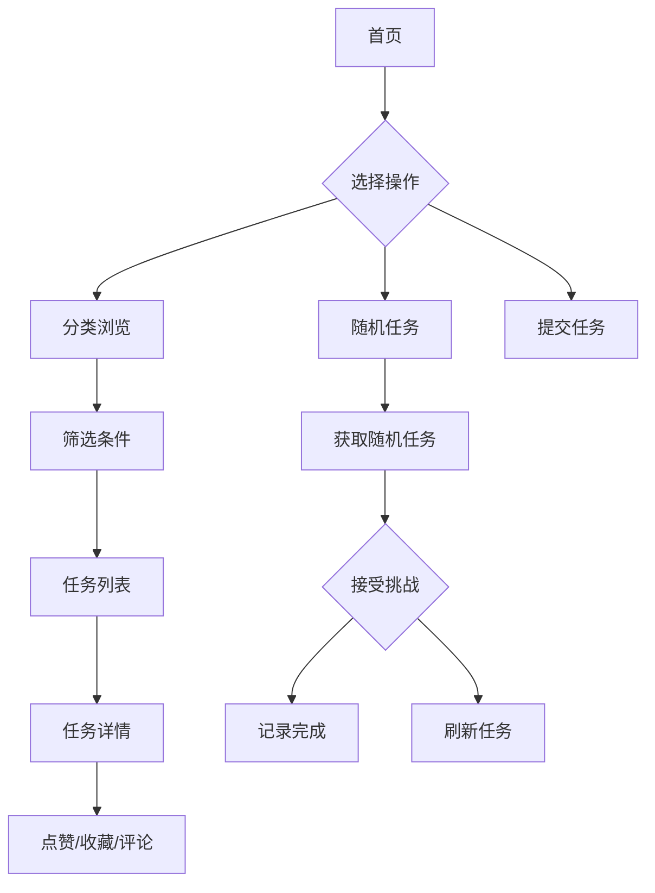

## 1. Product Overview

视频刷刷刷的你，是否会觉得人生些许空虚？空有手机在手，却萎靡不振！那么，请速速加入"给我个任务"！笨人通过观察，做出这款基于抖音热梗的趣味任务分享平台，大家可以浏览、筛选、随机获取各类创意任务，也可以提交自己的任务供他人挑战。平台旨在帮助用户打破日常单调，发现有趣的新事物，提升生活品质。

- **核心目标**：提供丰富多样的任务，让用户通过完成任务获得成就感和乐趣
- **目标用户**：年轻人、学生、上班族，喜欢挑战和尝试新事物的人群
- **市场价值**：为用户平淡的日常增添色彩，活人感药剂来也。填补创意任务分享平台的空白，打造一个有趣、互动的任务社区

## 2. Core Features

### 2.1 User Roles
| Role | Registration Method | Core Permissions |
|------|---------------------|------------------|
| Normal User |无需注册 |浏览任务、随机获取任务、提交任务、收藏任务 |

### 2.2 Feature Module
1. **首页**：Hero区域、热门任务推荐、快速入口
2. **分类浏览页**：多维度筛选、任务卡片列表、瀑布流布局
3. **随机任务页**：随机任务生成、任务接受、完成记录
4. **任务详情页**：任务信息、评论、点赞、收藏
5. **提交任务页**：任务表单、分类选择

### 2.3 Page Details
| Page Name | Module Name | Feature description |
|-----------|-------------|---------------------|
| 首页 | Hero区域 |展示平台主题，提供随机任务和分类浏览的快捷入口 |
| 首页 | 热门任务 |展示当前最受欢迎的任务卡片 |
| 分类浏览页 | 筛选面板 |四个维度（地点、时间、类型、难度）的标签筛选，支持多选 |
| 分类浏览页 | 任务列表 |瀑布流展示任务卡片，实时响应筛选条件 |
| 随机任务页 | 任务展示 |展示随机获取的任务，支持刷新和接受操作 |
| 随机任务页 | 完成记录 |展示用户已完成的随机任务 |
| 任务详情页 | 任务信息 |展示任务的完整信息，包括描述、标签、难度等 |
| 任务详情页 | 互动功能 |支持点赞、收藏、评论 |
| 提交任务页 | 任务表单 |用户填写任务信息，选择分类标签 |

## 3. Core Process

用户使用流程：
1. 用户访问首页，浏览热门任务或点击随机任务获取挑战
2. 用户可以进入分类浏览页，通过四个维度筛选任务
3. 用户点击任务卡片查看详情，可以点赞、收藏、评论
4. 用户可以提交自己的创意任务
5. 用户可以在随机任务页获取随机挑战，并记录完成情况

## 4. User Interface Design

### 4.1 Design Style
- **主色调**：活力橙（#FF6B35）- 代表热情和挑战
- **辅助色**：清新蓝（#4ECDC4）- 代表平静和创意
- **中性色**：灰色系（#6B7280）- 文字和边框
- **按钮风格**：圆润圆角（12px），hover效果有轻微缩放和阴影变化
- **字体**：标题使用圆润可爱的无衬线字体（如PingFang SC, Poppins），正文使用清晰易读的字体
- **布局风格**：卡片式布局，顶部导航，侧边筛选
- **图标风格**：Emoji图标配合扁平化图标，活泼有趣

### 4.2 Page Design Overview

| Page Name | Module Name | UI Elements |
|-----------|-------------|-------------|
| 首页 | Hero区域 |大标题、副标题、两个CTA按钮（随机任务、分类浏览）、背景渐变动画 |
| 首页 | 热门任务 |横向滚动的任务卡片列表，显示任务标题、标签、点赞数 |
| 分类浏览页 | 筛选面板 |四个标签组（地点、时间、类型、难度），支持多选，选中高亮 |
| 分类浏览页 | 任务列表 |瀑布流布局，卡片展示任务信息，hover有悬浮效果 |
| 随机任务页 | 任务展示 |居中展示任务卡片，周围有装饰性元素，刷新按钮有动画效果 |
| 随机任务页 | 完成记录 |垂直列表，显示已完成任务，带勾选标记 |
| 任务详情页 | 任务信息 |大卡片展示任务详情，标签以徽章形式显示 |
| 任务详情页 | 互动功能 |底部操作栏，包含点赞、收藏、分享按钮 |
| 提交任务页 | 任务表单 |表单字段：标题、描述、分类选择（地点、时间、类型、难度） |

### 4.3 Responsiveness
- **桌面端**：侧边筛选面板 + 主内容区布局，卡片4列展示
- **平板端**：筛选面板变为顶部标签栏，卡片2-3列展示
- **移动端**：筛选面板折叠为下拉菜单，卡片单列展示，底部导航

### 4.4 3D Scene Guidance
- 暂无3D场景需求
