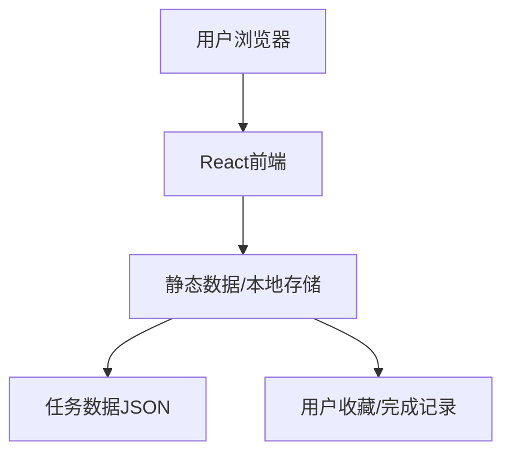
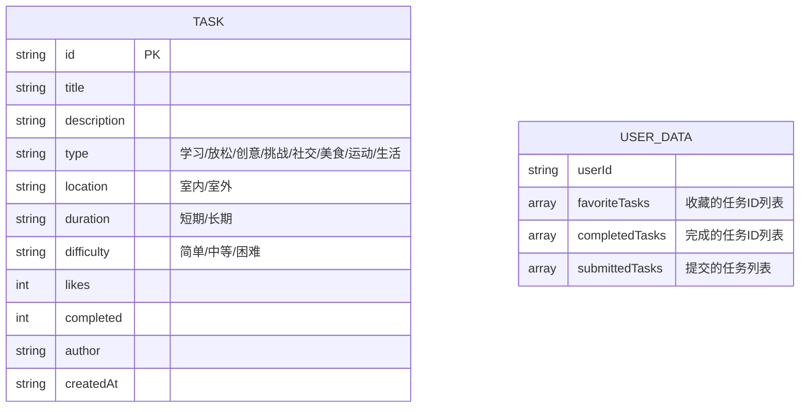

## 1. Architecture Design



## 2. Technology Description
- **Frontend**: React@18 + TypeScript + TailwindCSS@3 + Vite
- **Initialization Tool**: vite-init
- **Backend**: 无（纯前端项目，使用本地存储和静态数据）
- **Database**: LocalStorage + 静态JSON数据

## 3. Route Definitions
| Route | Purpose |
|-------|---------|
| `/` | 首页，展示Hero区域和热门任务 |
| `/browse` | 分类浏览页，多维度筛选任务 |
| `/random` | 随机任务页，获取随机挑战 |
| `/task/:id` | 任务详情页，展示任务完整信息 |
| `/submit` | 提交任务页，用户提交创意任务 |

## 4. API Definitions
- 无后端API，使用静态数据模拟

## 5. Server Architecture Diagram
- 无后端服务器

## 6. Data Model

### 6.1 Data Model Definition



### 6.2 Data Definition Language

**任务数据结构**（JSON格式）：
```json
{
  "id": "string",
  "title": "string",
  "description": "string",
  "type": "learning | relaxation | creative | challenge | social | food | sports | life",
  "location": "indoor | outdoor",
  "duration": "short | long",
  "difficulty": "easy | medium | hard",
  "likes": 0,
  "completed": 0,
  "author": "string",
  "createdAt": "string"
}
```

**用户数据结构**（LocalStorage存储）：
```json
{
  "favoriteTasks": ["taskId1", "taskId2"],
  "completedTasks": ["taskId1"],
  "submittedTasks": []
}
```
